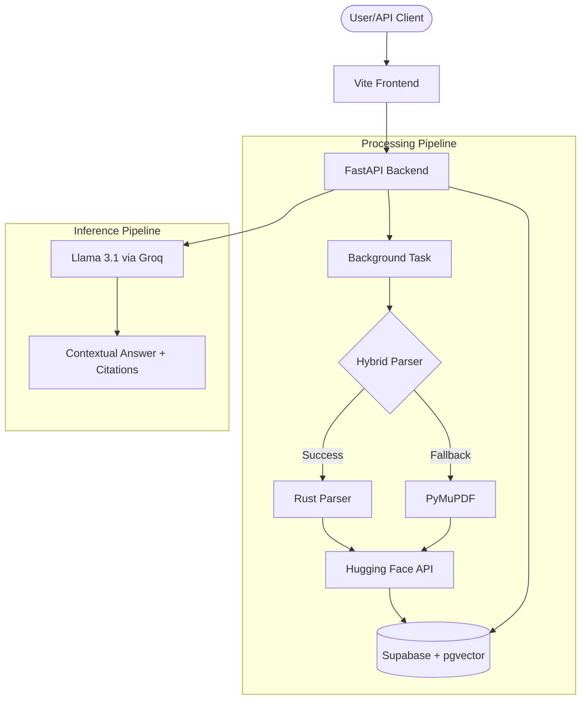

# 🔍 PDF Semantic Search


> **Elevate your document intelligence.** A state-of-the-art Retrieval-Augmented Generation (RAG) platform that transforms static PDFs into interactive, searchable knowledge bases using high-performance Rust parsing and hybrid vector storage.

---

## 🚀 Overview

**PDF Semantic Search** is a powerful, production-ready solution for intelligent document interaction. By combining the speed of **Rust** with the flexibility of **FastAPI** and the precision of **Llama 3.1**, this project enables users to upload vast amounts of PDF data and perform lightning-fast semantic queries that go beyond simple keyword matching.

### 🏆 Key Accomplishments

- **☁️ Supabase Integration**: Leverages Supabase for robust PostgreSQL hosting with `pgvector` and secure JWT-based authentication.
- **⚙️ Asynchronous Processing**: Implemented background workers using FastAPI's `BackgroundTasks` to handle intensive PDF parsing and embedding without blocking the API response.
- **📂 Session-Based Organization**: Introduced "Folders" to group related documents, enabling cleaner context management for complex research projects.
- **🦀 Hybrid Parsing Engine**: Integrated a custom high-performance Rust parser (`lopdf`) with a robust Python fallback (`PyMuPDF`) to handle complex PDF text extraction with 100% reliability.
- **🧠 Memory-Safe Architecture**: Optimized for cloud hosting (Render Free Tier) by offloading intensive embedding computation to the Hugging Face Inference API, reducing RAM footprint by 90%.

---

## ✨ Features

- 📁 **Session-Based Upload**: Organize documents into "Folders" for isolated context.
- ⚡ **Lightning Fast Inference**: Sub-second responses using Groq's Llama 3.1 70B model.
- 🦀 **Rust-Powered & Fail-Safe**: High-speed text extraction with automatic fallback for corrupted PDFs.
- 💨 **Low Resource Footprint**: Engineered to run on minimal hardware using remote embedding inference.
- 💬 **Smart Citations**: AI-generated answers include direct references and source tracking.
- 🌐 **Modern Vite Frontend**: Responsive, module-based JS frontend for a seamless user experience.

---

## 🛠️ Tech Stack

### Backend & AI

- **Framework**: [FastAPI](https://fastapi.tiangolo.com/) (Python 3.12+)
- **LLM**: Llama 3.1 (via [Groq](https://groq.com/))
- **Embeddings**: `bge-small-en-v1.5` (via [Hugging Face Inference API](https://huggingface.co/docs/api-inference/index))
- **Performance Engine**: [Rust](https://www.rust-lang.org/) (via [PyO3](https://pyo3.rs/))
- **Search**: [pgvector](https://github.com/pgvector/pgvector) on Supabase

### Infrastructure

- **Frontend**: [Vite](https://vitejs.dev/) + Vanilla JS
- **Database**: PostgreSQL (Vector-enabled)
- **Auth & Storage**: [Supabase](https://supabase.com/)
- **Dependency Management**: [uv](https://github.com/astral-sh/uv)
- **Deployment**: Docker (Backend) + Static Hosting (Frontend)

---

## 🏗️ Architecture



---

## 🚦 Getting Started

### 1. Prerequisites

- [Docker](https://www.docker.com/)
- [uv](https://github.com/astral-sh/uv)
- [Supabase Account](https://supabase.com/)
- [Groq API Key](https://console.groq.com/keys)
- [Hugging Face Token](https://huggingface.co/settings/tokens) (Free)

### 2. Setup Environment

Create a `.env` file in the root:

```env
GROQ_API_KEY=your_groq_api_key
HUGGING_FACE_API_KEY=your_hf_token
DATABASE_URL=your_supabase_postgresql_url
SUPABASE_URL=your_supabase_project_url
SUPABASE_KEY=your_supabase_anon_key
SUPABASE_JWT_SECRET=your_supabase_jwt_secret
LOCAL_SECRET_KEY=your_internal_secret
```

### 3. Build and Run

```bash
# 1. Install dependencies
uv sync

# 2. Build Rust parser extension (Local only)
uv run maturin develop

# 3. Start Backend
uv run uvicorn app.main:app --reload

# 4. Start Frontend (New Terminal)
cd frontend
npm install
npm run dev
```

### 4. Production Build

To generate optimized assets for production:

```bash
cd frontend
npm run build
```

The static files will be in `frontend/dist`.

The API supports session-based ingestion and retrieval:

- **Swagger UI**: `http://localhost:8000/docs`

### Key Endpoints

- `GET /api/v1/folders`: List all document sessions.
- `POST /api/v2/upload/{folder_id}`: Upload a document to a specific session (Async).
- `POST /api/v2/chat/{folder_id}`: Semantic chat within a session's context.

---

## 🗺️ Roadmap

- [x] **Sub-linear Scaling**: Full migration to `pgvector` on Supabase.
- [x] **Async Processing**: Background document ingestion tasks.
- [x] **Modular Frontend**: Transitioned to a modern Vite/ESM architecture.
- [x] **Memory-Safe Pipeline**: Hugging Face API integration for cloud stability.
- [ ] **Cross-file Summarization**: Generate insights across a whole folder.
- [ ] **OCR Support**: For scanned PDFs using Tesseract.
- [ ] **Advanced Semantic Reranking**: Using Cohere or BGE-Reranker.

---

<p align="center">
  Developed with ❤️ for high-performance semantic search.
</p>
